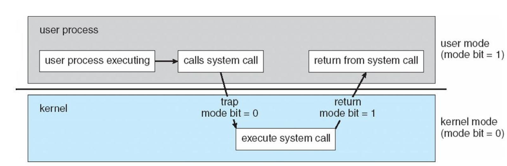
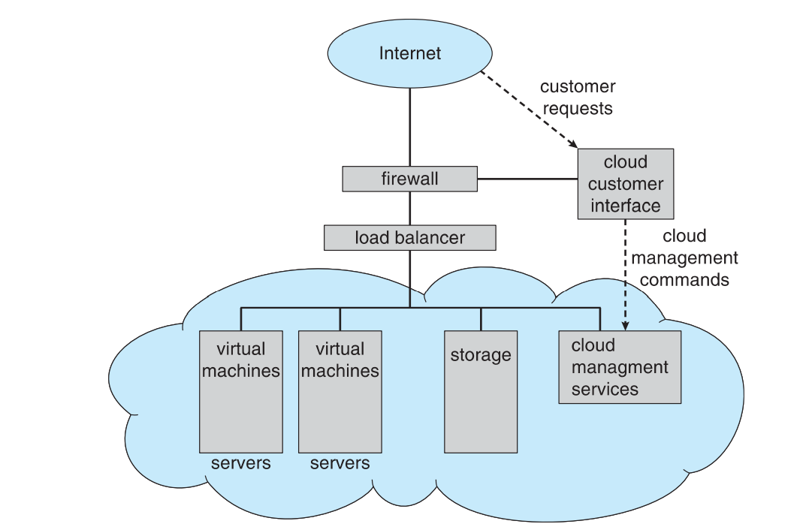
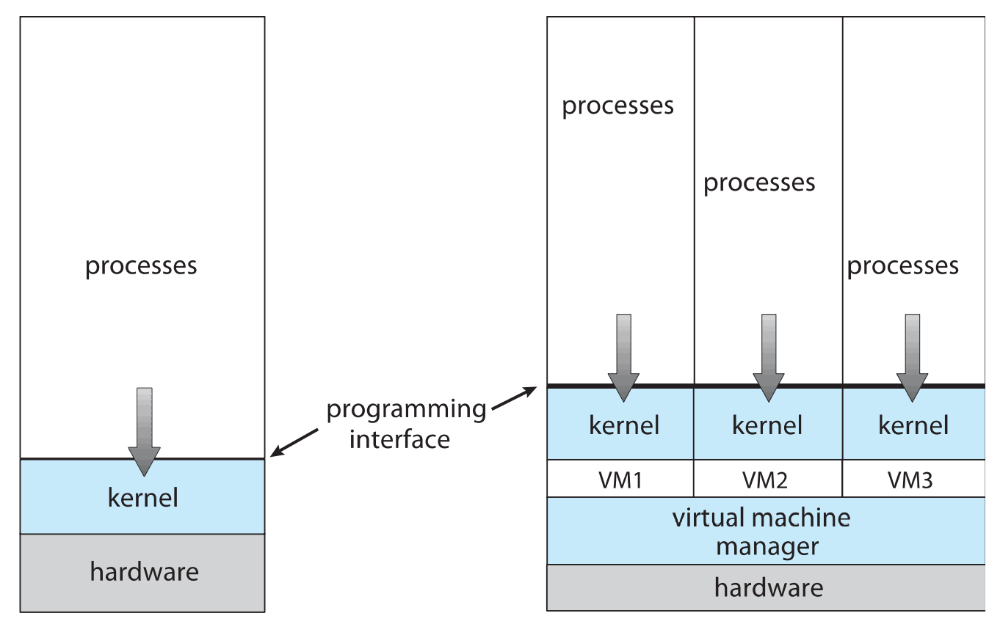

# OS Midterm
---

# Ch 1 ( x % )
* os 做的事
    * 讓電腦系統更好使用
    * 執行使用者的程式
    * 有效的運用電腦硬體

* Interrupt
    * 中斷是裝置告訴CPU自己做完事情的指令
    * 中斷指令會利用將包含所有服務程序地址的中斷矩陣傳送給中斷服務程序來移交控制權
    * 中斷的架構中必須存放被中斷指令的位置
    * `異常`跟`例外`是由錯誤或使用者的要求所產生的中斷
    * 作業系統是由中斷驅動
    * 作業系統會用儲存暫存器及程式計數器的方式保留CPU狀態
    * 判斷何種中斷發生的方法:
        * 輪詢
        * 向量化中斷系統
    * 代碼的不同片段決定各種相對應中斷該做的動作
    
    
* catching
    * 暫時將訊息從慢的記憶體複製到快的記憶體
    * 快取記憶體的大小比被塊取的記憶體還小

* kernel mode tranfer
    * 

* cloud computing
    * 

* virtulization
    * Emulation ( 仿真 ):
        * 最慢
    * Virtualization ( 虛擬化 ):作業系統跟虛擬作業系統皆在本地對CPU進行編譯
        * 由VMM ( virtual machine manager ) 提供虛擬化服務
    * 

# Ch 2 ( y % )
* system-call:
    * 關係:
    
    * 種類:
        * process control
        * file management
        * device management
        * information maintenance
        * communications
        * protection
* 作業系統的結構:
    * simple structure:
    * none simple structure:
        * systems programs
        * kernel
    * layered approach:
        * layer 0: 硬體
        * 使用者只會從lower-layer獲得想用的功能
    * microkernel:
        * 優:
            * 微內核擴展方便
            * 可以很容易的將作業系統移植到新的架構
            * 更穩定(在內核跑的程式更少)
            * 更安全
        * 缺:
            * 使用者和內核的溝通性能提升
* android vs ios
    * android:
        * open source
        * modified Linux kernel
    * ios:
        * mac OS X kernel
        * 可以在不同CPU結構上運行`Max OS X`的應用程式

# Ch 3 ( z % )
* process stat
    * new
    * running
    * waiting
    * ready
    * terminated
* PCB switch( process control block ):
    
* schedules compare
* chrome's multi-processor implementation
    * browser:管理使用者介面、硬碟及網路輸出入的程序
    * renderer:處理HTML、JS的程序，一個網頁開啟時產生一個
    * plug-in:插件程序
* remote procedure call
    * 客戶端stubs找到伺服器並編組參數
    * 伺服器端stubs接收訊息、解壓縮編組的參數、在伺服器上執行該過程
    * XDL
    * MIDL
    * matchmaker: 一種用來連接客戶及伺服器端的作業系統服務

# Ch 4 ( 30% )
* Implicit Threading
    * creation and management done by compilers and run-time libraries instead of programmers
    * Thread Pools
    * OpenMP
    * Grand Central Dispatch

* Concurrency and parallelism
    * concurrency: 多個執行序互相幫忙，共享資源
    * parallelism: 多個執行序各自做各自的事情

* multithreading models:
    * many-to-one:many user threads to one kernel thread, one thread blocking causes all to block
    * one-to-one:cuncurreny, overhead
    * many-to-many:allow kenel create more than one thread

# x + y + z = 70
